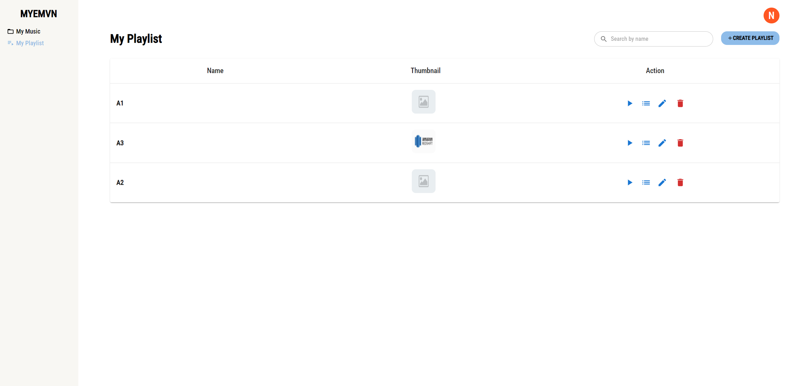

# How to run source
## Use docker-compose
1. Install Docker and docker-compose
2. cmd at root folder (containing this file)
3. Run all services using : `docker-compose up`
4. Visit UI via: `http://localhost:3000`
## Run Frontend vs Backend separately
### Frontend
1. Start cmd at frontend folder
2. Install package : `npm i`
3. Run: `npm run dev`
### Backend 
1. Database required. Start DB first using Docker `docker-compose up mongodb`
2. Start cmd at backend folder
3. Run: `go run main.go server`

# Demo
### Music page

### Playlist page

### Add music to playlist

### Edit

